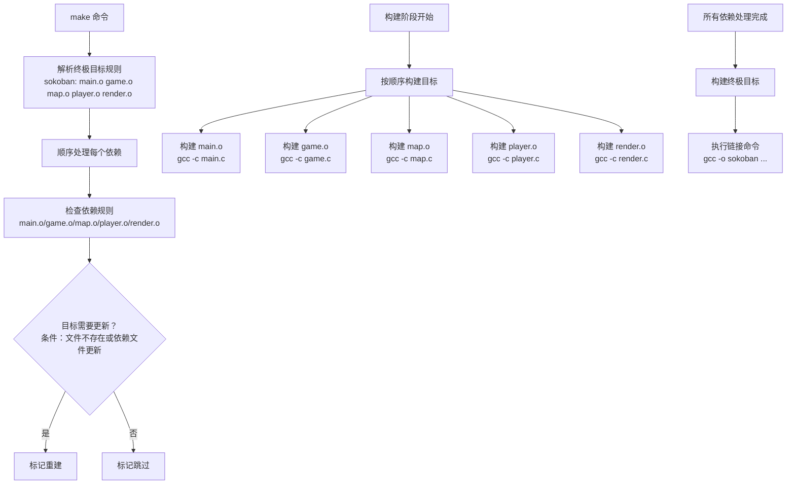

## make

这是gnu_make

### makefile的命名
&emsp;默认的情况下，make 会在工作目录（执行 make 的目录）下按照文件名顺序寻找
makefile 文件读取并执行，查找的文件名顺序为：“GNUmakefile”、“makefile”、
“Makefile”

&emsp;当不想使用以上三个命名方式时，通过 make 的"-f NAME"或者"--file=NAME"指定make 读取的 makefile 文件

### 一个简单的Makefile

```shell
objects = main.o game.o map.o player.o\
			render.o

sokoban: $(objects)
	gcc -o sokoban $(objects)

main.o: main.c game.h map.h player.h
#	gcc -c main.c

game.o: game.h map.h player.h render.h
#	gcc -c game.c

map.o: map.h
#	gcc -c map.c

player.o: player.h map.h
#	gcc -c player.c

render.o: render.h map.h
#	gcc -c render.c

.PHONY: clean
clean:
	-rm $(objects) sokoban
```

- 书写时可以使用\来分解多行，注意\之后不能有空格
- 第一条规则之后的所有以[TAB]开始的字符都是命令行
- 使用objects变量替代了所有.o文件
- 编译.c源文件时，编译.c源文件规则的命令可以不用明确给出
- 我们只需要给出需要重建的目标文件名（一个.o文件），make会自动为这个.o文件寻找合适的依赖文件(文件名除后缀外，其余都相同的两个文件)
- PHONY声明了clean是个伪目标

### make的工作流程

1. 解析阶段：
- make 识别终极目标 sokoban 及其依赖列表
- 按顺序处理每个依赖（main.o → game.o → map.o → player.o → render.o）
- 对每个目标检查构建条件：
    - 目标文件不存在
    - 或任何依赖文件比目标文件新
    - 标记需要重建的目标

2. 构建阶段：
- 严格按照依赖列表顺序构建每个目标：
    - main.o（如需要）
    - game.o（如需要）
    - map.o（如需要）
    - player.o（如需要）
    - render.o（如需要）

- 最后构建终极目标 sokoban（如果任何依赖更新或可执行文件不存在）

### 包含其他Makefile文件

include告诉make暂停读取当前的Makefile，转而去读取include指定的一个或多个文件

### 更详细的make解析Makefile的过程

MakefielS规则：
TARGET: PREREQUISITES
[TAB]COMMAND

TAGET: 规则的目标，通常是最后需要生成的目标/为了实现这个目标而必须的中间过程文件名
PREREQUISITES：规则的依赖，生成规则目标所需要的文件名列表
COMMAND：规则的命令行，是规则所要执行的动作，一个规则可以有多个命令行

Makefile 中“规则”就是描述在什么情况下、如何重建规则的目标文件
一个规则的目标可以没有依赖只有命令行，比如Makefile中的目标clean

执行规则命令行的条件：
- 目标文件不存在
- 依赖文件存在一个依赖的最后修改时间比目标文件的晚

要想使用$，需要写$$

order-only依赖

### 规则

#### 静态模式规则

语法：
&nbsp;&nbsp;&nbsp;&nbsp;目标: 目标模式: 依赖模式
&nbsp;&nbsp;&nbsp;&nbsp;&nbsp;&nbsp;&nbsp;&nbsp;命令
- “目标”：是一系列的目标文件，可以包含通配符
- “目标模式”和“依赖模式”：从目标模式的目标名字中抽取一部分字符串（称为“茎”）。使用“茎”替代依赖模式（PREREQ-PATTERNS）中的相应部分来产生对应目标的依赖文件

```Makefile
# 举一个例子
obj/start.o: obj/%.c %.s

start就是茎，依赖文件就是start.s
```

### 变量

#### 自动变量

```makefile
$@: 规则的目标
$<：规则的第一个依赖
$^：规则的依赖列表
```

### 函数

#### patsubst函数
作用：
&nbsp;&nbsp;&nbsp;&nbsp;用于模式替换

基本语法：
&nbsp;&nbsp;&nbsp;&nbsp;$(patsubst pattern,replacement,text)
- 它会在 text 中查找匹配 pattern 的部分，并替换为 replacement
- pattern: 要匹配的模式（可以包含通配符 %）
- replacement: 替换模式（可以使用 % 来引用匹配的部分）
- text: 要进行替换操作的文本

#### foreach函数
作用：
&nbsp;&nbsp;&nbsp;&nbsp;用于对列表中的每个元素执行操作

基本语法：
&nbsp;&nbsp;&nbsp;&nbsp;$(foreach var, list, text)
- var: 临时变量名，用于引用列表中的当前元素
- list: 要遍历的列表
- text: 对每个元素执行的操作

说明：
&nbsp;&nbsp;&nbsp;&nbsp;展开var和list的引用，text不展开；依次将list中的内容赋值给var，执行text表达式，知道list为空

```Makfile
# 举一个例子
dirs := a b c d

$foreach(dir $(dirs) $(wildcard $(dir)/*))

会被展开成
    $(wildcard a/*)
    $(wildcard b/*)
    $(wildcard c/*)
    $(wildcard d/*)
```

#### wildcard函数
作用：
&nbsp;&nbsp;&nbsp;&nbsp;用于获取匹配指定模式的文件列表

基本语法：
&nbsp;&nbsp;&nbsp;&nbsp;$(wildcard pattern)

#### notdir函数
作用：
&nbsp;&nbsp;&nbsp;&nbsp;用于从文件路径中提取文件名部分

基本语法：
&nbsp;&nbsp;&nbsp;&nbsp;$(notdir names...)
