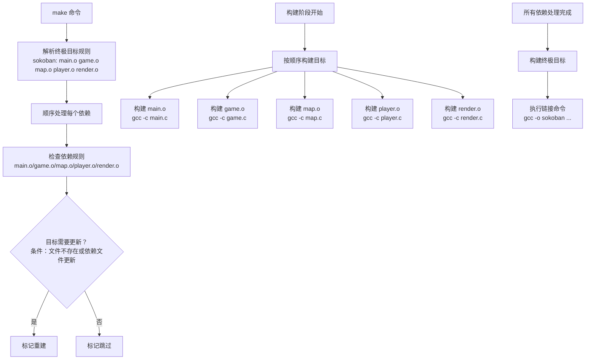

## make

这是gnu_make

### makefile的命名
&emsp;默认的情况下，make 会在工作目录（执行 make 的目录）下按照文件名顺序寻找
makefile 文件读取并执行，查找的文件名顺序为：“GNUmakefile”、“makefile”、
“Makefile”

&emsp;当不想使用以上三个命名方式时，通过 make 的"-f NAME"或者"--file=NAME"指定make 读取的 makefile 文件

### 一个简单的Makefile

```shell
objects = main.o game.o map.o player.o\
			render.o

sokoban: $(objects)
	gcc -o sokoban $(objects)

main.o: main.c game.h map.h player.h
#	gcc -c main.c

game.o: game.h map.h player.h render.h
#	gcc -c game.c

map.o: map.h
#	gcc -c map.c

player.o: player.h map.h
#	gcc -c player.c

render.o: render.h map.h
#	gcc -c render.c

.PHONY: clean
clean:
	-rm $(objects) sokoban
```

- 书写时可以使用\来分解多行，注意\之后不能有空格
- 第一条规则之后的所有以[TAB]开始的字符都是命令行
- 使用objects变量替代了所有.o文件
- 编译.c源文件时，编译.c源文件规则的命令可以不用明确给出
- 我们只需要给出需要重建的目标文件名（一个.o文件），make会自动为这个.o文件寻找合适的依赖文件(文件名除后缀外，其余都相同的两个文件)
- PHONY声明了clean是个伪目标

### make的工作流程

1. 解析阶段：
- make 识别终极目标 sokoban 及其依赖列表
- 按顺序处理每个依赖（main.o → game.o → map.o → player.o → render.o）
- 对每个目标检查构建条件：
    - 目标文件不存在
    - 或任何依赖文件比目标文件新
    - 标记需要重建的目标

2. 构建阶段：
- 严格按照依赖列表顺序构建每个目标：
    - main.o（如需要）
    - game.o（如需要）
    - map.o（如需要）
    - player.o（如需要）
    - render.o（如需要）

- 最后构建终极目标 sokoban（如果任何依赖更新或可执行文件不存在）

### 包含其他Makefile文件

include告诉make暂停读取当前的Makefile，转而去读取include指定的一个或多个文件

### 更详细的make解析Makefile的过程

MakefielS规则：
TARGET: PREREQUISITES
[TAB]COMMAND

TAGET: 规则的目标，通常是最后需要生成的目标/为了实现这个目标而必须的中间过程文件名
PREREQUISITES：规则的依赖，生成规则目标所需要的文件名列表
COMMAND：规则的命令行，是规则所要执行的动作，一个规则可以有多个命令行

Makefile 中“规则”就是描述在什么情况下、如何重建规则的目标文件
一个规则的目标可以没有依赖只有命令行，比如Makefile中的目标clean

执行规则命令行的条件：
- 目标文件不存在
- 依赖文件存在一个依赖的最后修改时间比目标文件的晚

要想使用$，需要写$$

order-only依赖
