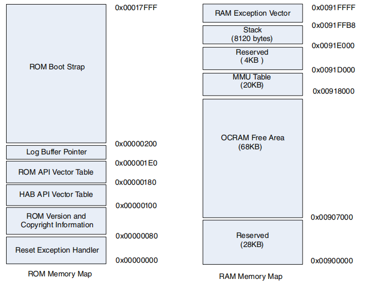

## uboot

下载地址：
&emsp;https://ftp.denx.de/pub/u-boot/

### 目录结构

链接脚本，放在u-boot/arch/arm/cpu/u-boot.lds

配置文件，configs目录

整个代码的入口，u-boot/arch/arm/cpu/start.S

在哪里去找头文件
- u-boot/include
- u-boot/arch/arm/include

### 启动机制
#### 恩智浦imx6ull启动机制

boot ROM支持NOR flash、NAND flash、oneNAND flash、SD/MMC、Serial NOR flash and EEPROM以及Quad SPI flash

##### boot mode
- 引导模式取决于BOOT_MODE[1:0]寄存器
- BOOT_MODE0和BOOT_MODE1在POR_B的上升沿被初始化（锁存），后来的状态不会影响BOOT_MODE[1:0]
- BOOT_MODE0的状态可以从BMOD[1:0] (SRC_SBMR2) 读到

|BOOT_MODE[1:0]|boot type|
|---|---|
|00|boot from fuse|
|01|serial downloader|
|10|internal boot|
|11|reserved|

##### HAB(high-assurance boot)

##### 内部启动模式
boot ROM code执行硬件初始化，从选择的设备加载程序镜像，使用HAB库执行镜像验证，然后跳转到程序镜像中衍生出的一个地址

##### 设备初始化

- ROM/RAM的内存映射

- MMU/Cache
    - MMU和Cache可以加快引导速度
    - L1指令Cache在镜像下载开始时使能
    - L1数据Cache、L2 Cache以及MMU在镜像认证时使能

- 异常处理
    - 异常向量位于ROM的开始，用于映射除复位以外所有的ARM异常到内部RAM中的异常向量表
    - cpu0的引导阶段，RAM向量指向ROM中的串行下载器
    - 

- 引导阶段的中断处理
&emsp;引导ROM程序执行中断被关闭

- persistent bit

##### 程序镜像
    
程序镜像需要包含以下内容image vertor table、boot data、device configuration data以及user code and data

- IVT
    - IVT是引导设备中的数据结构，供boot ROM读取
    - IVT在一个固定的地址，不同的引导设备对应不同的IVT偏移地址以及程序加载大小
    - IVT结构

|引导设备类型|ivt偏移|初始加载区域大小|
|---|---|---|
|NOR|4KB|整个镜像大小|
|oneNAND|256B|1KB|
|SD/MMC/eSD/eMMC/SDXC|1KB|4KB|
|SPI EEPROM|1KB|4KB|

|IVT format|
|---|
|header|
|entry：镜像中第一条指令的绝对地址|
|reserved1|
|dcd：镜像中DCD的绝对地址|
|boot：引导数据的绝对地址|
|self：IVT的绝对地址|
|csf：HAB库使用的命令序列文件的绝对地址|
|reserved2|

Header
|Tag|Length|Version|
|---|---|---|
|0xd2|IVT的长度，包括Header|0x41|

- BOOT DATA

引导数据的格式
|内容|含义|
|---|---|
|start|镜像的绝对地址|
|length|程序镜像的大小|
|Plugin|插件标志|

- DCD

  - 根据IVT中的信息确定DCD表的位置
  - DCD表被限制到1768 Bytes

DCD表的数据格式
|Header|
|---|
|[CMD]|
|[CMD]|
|...|

Header
|Tag|Length|Version|
|---|---|---|
|0xd2|DCD表的长度，包括Header|0x41|

- 写数据命令

|Sequence||
|---|---|
|0|Tag(0xCC) Length(写数据命令的长度，包括头部) Parameter|
|1|Address（目标地址）|
|2|Value/Mask（数据值/位掩码）|
|3|Address|
|4|Value/Mask|
|...|...|

Parameter
|7~3|2~0|
|---|---|
|flags（命令行为的控制标志）|bytes(目标位置的宽度)|

写数据命令的说明
|Mask|Set|Action|Interpretation|
|---|---|---|---|
|0|0|*address = val_msk|write value|
|0|1|*address = val_msk|write value|
|1|0|*address &= ~val_msk|Clear bitmask|
|1|1|*address |= val_msk|Set bitmask|

- 校验数据命令
- NOP命令
- 解锁命令

6410启动机制
1. iROM (Boot ROM) 阶段
- 芯片上电后，首先执行固化在内部 iROM 中的代码
- iROM 代码执行基本的初始化工作，包括配置系统时钟、看门狗定时器等
- iROM 代码根据预配置的启动顺序（例如 OM 引脚设置），从选定的外部存储器（如 NAND Flash、SD 卡等）中读取前 4KB 数据（即 BL1 阶段代码）

1. BL1 (1st Stage Bootloader) 阶段
- 读取到的 BL1 代码被加载到片内 SRAM（通常称为 Stepping Stone）去执行，代码里自己会判断是在片内SRAM还是系统主内存（DDR SDRAM），
如果在静态SRAM，就会初始化系统主内存以及其他运行完整 Bootloader 所需的关键外设

1. BL2 (2nd Stage Bootloader) 阶段
- 完成内存初始化后，BL1 从外部存储器中将 整个Bootloader加载到已初始化的 DDR SDRAM 中
- 跳转到u-boot的入口开始运行，判断自己在片内SRAM还是系统主内存
- 如果在系统主内存中，直接跳到4K以后的内容，开始运行BL2

1. 操作系统 (OS) 加载阶段：
- BL2（通常是 U-Boot）从外部存储器中将操作系统内核映像加载到 DDR SDRAM 中的预定地址
- BL2 最后跳转到操作系统内核的入口地址，将控制权完全移交给操作系统，启动过程完成

V210启动机制
1. iROM (Boot ROM) 阶段
- 芯片上电后，首先执行固化在内部 iROM 中的代码
- iROM 代码执行基本的初始化工作，包括配置系统时钟、看门狗定时器等
- iROM 代码根据预配置的启动顺序（例如 OM 引脚设置），从选定的外部存储器（如 NAND Flash、SD 卡等）中读取前 16KB 数据（uboot_spl.bin）

2. BL1 (1st Stage Bootloader) 阶段
- 读取到的 BL1 代码被加载到片内 SRAM（通常称为 Stepping Stone）去执行，绕开片内RAM的BL2，直接配置系统主内存，再把uboot.bin加载到动态DDR内存

3. BL2 (2nd Stage Bootloader) 阶段
- 跳转到uboot主体（uboot.bin）的入口开始运行

4. 操作系统 (OS) 加载阶段：
- BL2 最后跳转到操作系统内核的入口地址，将控制权完全移交给操作系统，启动过程完成

### uboot命令
|命令|用法|描述|示例|示例说明|
|---|---|---|---|---|
| bdinfo | bdinfo | 显示开发板硬件信息 | bdinfo | 显示内存布局、时钟等板级信息 |
| printenv | printenv [变量名] | 打印环境变量 | printenv bootcmd | 显示 bootcmd 环境变量的值 |
| setenv | setenv <变量名> <值> | 设置环境变量 | setenv ipaddr 192.168.1.10 | 设置 ipaddr=192.168.1.10 |
| saveenv | saveenv | 保存环境变量到存储|saveenv | 将变量写入 Flash/EEPROM |
| md | md[.b/.w/.l] <地址> [长度] | 显示内存内容|md.w 0x80000000 10 | 显示 16 个 word (4字节) 数据 |
| nm | nm[.b/.w/.l] <地址> | 交互式修改内存（固定地址）| nm.l 0x80000000 | 修改地址 0x80000000 的 32 位数据 |
| mm | mm[.b/.w/.l] <起始地址> |交互式修改内存（地址自增）| mm.w 0x80000000 | 修改内存，地址自动增加|
| mw | mw[.b/.w/.l] <地址> <值> [长度] | 填充内存区域 | mw.l 0x80000000 0xdeadbeef 10 | 填充 10 个 32 位值 |
| cp | cp[.b/.w/.l] <源地址> <目标地址> <长度> | 内存复制 | cp.b 0x82000000 0x83000000 0x1000 | 复制 4KB (4096 字节) 数据 |
| cmp | cmp[.b/.w/.l] <地址1> <地址2> <长度> | 内存比较 |cmp.l 0x80000000 0x81000000 100 | 比较 100 个 32 位数据 |
