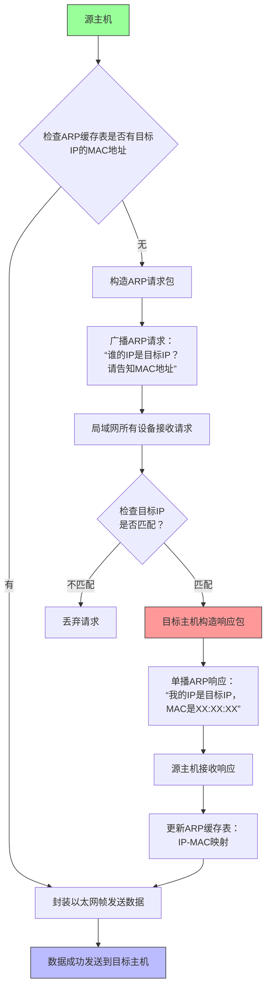
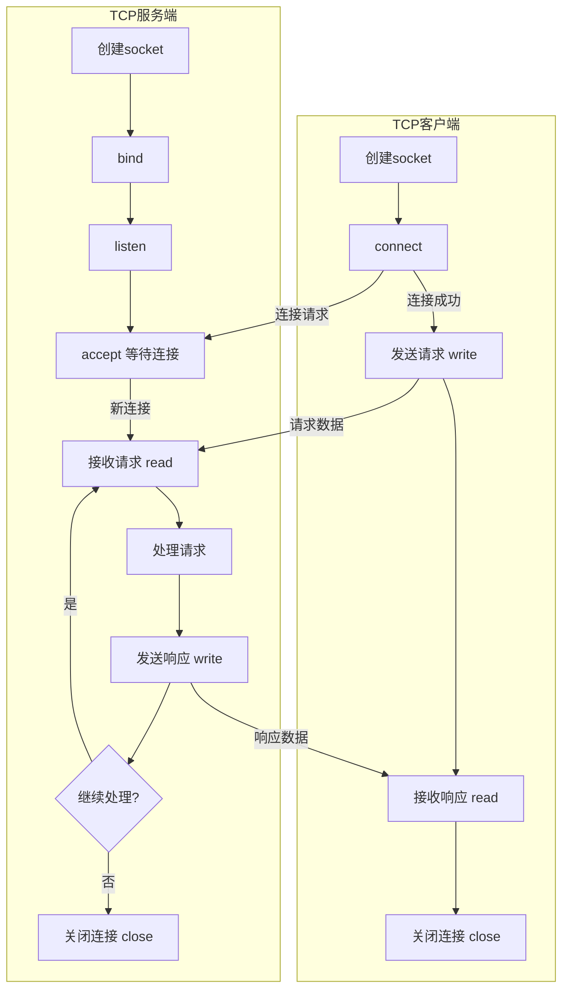

# Linux

## 网络编程

### 网络基础
#### 分层模型结构
- **OSI七层模型**：物理层、数据链路层、网络层、传输层、会话层、表示层、应用层
- **TCP/IP模型**：网络接口层、网络层、传输层、应用层
    1. 应用层：HTTP、FTP、NFS、SSH
    2. 传输层：TCP、UDP
    3. 网络层：IP、ICMP、IGMP
    4. 链路层：以太网帧协议，ARP协议

#### 通信过程
1. **应用层**：浏览器生成HTTP请求 `GET /index.html`  
2. **传输层**：TCP封装（源端口随机 >1024，目标端口80）  
3. **网络层**：IP封装（源IP=192.168.1.2，目标IP=172.217.160.110）  
   → 若目标MAC未知，触发**ARP请求**（链路层）  
4. **链路层**：以太网帧封装（目标MAC=路由器MAC）  
5. **物理层**：转换为电信号通过网卡发送  
6. **路由器**：  
   - 链路层拆帧 → 网络层查路由表 → 修改目标MAC为下一跳 → 链路层重新封装  
7. **服务器接收**：  
   - 物理层接收 → 链路层校验 → 网络层IP解包 → 传输层TCP重组 → 应用层HTTP响应

#### 各协议概念和功能
ARP协议
- ARP协议是计算机网络中用于**将IP地址解析为MAC地址**的关键协议
- ARP协议只能解析同一个网段（同一广播域）内的MAC地址
- ARP数据包的格式

  
    1. 硬件类型，2字节，指明网络硬件接口类型，0x0001(以太网)，0x0006(IEEE 802网络)
    2. 协议类型，2字节，指明上层协议类型，0x0800(IPv4)
    3. 硬件地址长度，1字节，MAC地址的长度，以太网中为6
    4. 协议地址长度，1字节，上层协议地址的长度，IPv4中为4
    5. 操作，2字节，指明ARP数据包类型，1(ARP请求)，2(ARP响应)
- ARP寻址的基本过程：

IP协议

TCP协议

### Socket编程

#### 网络套接字
网络套接字(Socket)是操作系统提供的**应用程序与网络协议栈之间的编程接口**，它允许不同主机（或同一主机）上的进程通过网络进行通信

#### 常用结构体
```c
//旧
struct sockaddr {
    sa_family_t sa_family;
    char        sa_data[14];
}

//新
struct in_addr {
    uint32_t       s_addr;     /* address in network byte order */
};

struct sockaddr_in {
    sa_family_t    sin_family; /* address family: AF_INET */
    in_port_t      sin_port;   /* port in network byte order */
    struct in_addr sin_addr;   /* internet address */
};

```

#### 常用函数

```c
#include <arpa/inet.h>

// tcp/ip协议规定，网络数据流采用大端字节序
uint32_t htonl(uint32_t hostlong);
uint16_t htons(uint16_t hostshort);//host byte order to network byte order
uint32_t ntohl(uint32_t netlong);
uint16_t ntohs(uint16_t netshort);//network byte order to host byte order

//ip地址转换
/**
 * =============================================================================
 * @header  #include <arpa/inet.h>
 *
 * @brief   IP地址字符串转二进制格式 (可读字符串 → 网络字节序)
 * 
 * @param[in]   af      地址族 (Address Family):
 *                      • AF_INET   → IPv4地址
 *                      • AF_INET6  → IPv6地址
 * 
 * @param[in]   src     输入IP字符串指针
 * 
 * @param[out]  dst     输出转换后的网络字节序的IP地址
 * 
 * @return      状态码:
 *              •  1 → 转换成功
 *              •  0 → 输入无效 (非合法IP格式)
 *              • -1 → 系统错误 (通过errno获取详情)
 * 
 * =============================================================================
 */
int inet_pton(int af, const char *src, void *dst);

/**
 * =============================================================================
 * @header  #include <arpa/inet.h>
 *
 * @brief   inet_pton的逆序操作
 * 
 * @param[in]   af      地址族 (Address Family):
 *                      • AF_INET   → IPv4地址
 *                      • AF_INET6  → IPv6地址
 * 
 * @param[in]   src     输入网络字节序IP地址
 * 
 * @param[out]  dst     输出IP字符串
 * 
 * @param[out]  size    dst大小
 * 
 * @return      状态码:
 *              •  dst  → 转换成功
 *              •  NULL → 错误
 * 
 * =============================================================================
 */
const char *inet_ntop(int af, const void *src, char *dst, socklen_t size);

//模型创建函数
/**
 * =============================================================================
 * @header #include <sys/types.h> #include <sys/socket.h>
 *
 * @brief   创建一个套接字
 * 
 * @param[in]   domain      协议族 (Protocol Family):
 *                          • AF_INET   → IPv4协议
 *                          • AF_INET6  → IPv6协议
 *                          • AF_UNIX   → 本地套接字通信
 *
 * @param[in]   type        套接字类型
 *                          • SOCK_STREAM   → 面向连接的可靠字节流（TCP）
 *                          • SOCK_DGRAM    → 无连接的数据报服务（UDP）
 *                          • SOCK_RAW      → 原始套接字
 * 
 * @param[in]   protocol    指定协议
 *                          • 通常设为 0（表示根据 domain 和 type 选择默认协议）
 *                          • IPPROTO_TCP - TCP 协议
 *                          • IPPROTO_UDP - UDP 协议
 * 
 * @return      状态码:
 *              •  fd   → 返回新创建的套接字文件描述符
 *              •  -1   → 失败，并设置errno
 * 
 * =============================================================================
 */
int socket(int domain, int type, int protocol);

/**
 * =============================================================================
 * @header #include <sys/types.h> #include <sys/socket.h>
 *
 * @brief   将套接字与特定的 IP 地址和端口号关联起来，为套接字分配一个本地名称
 * 
 * @param[in]   sockfd      socket() 返回的套接字文件描述符
 *
 * @param[in]   addr        指向包含地址信息的结构体指针
 * 
 * @param[in]   addrlen     地址结构体的长度
 * 
 * @return      状态码:
 *              •  0    → 成功
 *              •  -1   → 失败，并设置errno
 * 
 * =============================================================================
 */
int bind(int sockfd, const struct sockaddr *addr, socklen_t addrlen);

/**
 * =============================================================================
 * @header #include <sys/types.h> #include <sys/socket.h>
 *
 * @brief   将一个主动连接的Socket（通常是调用socket()和bind()之后的Socket）转换为被动监听的Socket
 * 
 * @param[in]   sockfd      已成功绑定(bind())到本地地址和端口的Socket描述符
 *
 * @param[in]   backlog     连接请求队列的最大长度
 * 
 * @return      状态码:
 *              •  0    → 成功
 *              •  -1   → 失败，并设置errno
 * 
 * =============================================================================
 */
int listen(int sockfd, int backlog);

/**
 * =============================================================================
 * @header #include <sys/types.h> #include <sys/socket.h>
 *
 * @brief   从已完成连接队列的头部取出一个已建立的连接，如果队列为空，accept()会阻塞，直到有新的连接建立
 * 
 * @param[in]   sockfd      处于LISTEN状态的监听Socket描述符
 *
 * @param[out]   addr       指向sockaddr结构体的指针，用于获取发起连接的那个客户端的地址信息
 * 
 * @param[out]   addrlen    输入时为addr的大小，输出时为客户端addr实际大小
 * 
 * @return      状态码:
 *              •  fd   → 返回一个新的、非负的Socket描述符
 *              •  -1   → 失败，并设置errno
 * 
 * =============================================================================
 */
int accept(int sockfd, struct sockaddr *addr, socklen_t *addrlen);

/**
 * =============================================================================
 * @header #include <sys/types.h> #include <sys/socket.h>
 *
 * @brief   从已完成连接队列的头部取出一个已建立的连接，如果队列为空，accept()会阻塞，直到有新的连接建立
 * 
 * @param[in]   sockfd      客户端的socket函数返回值
 *
 * @param[in]   addr        指定目标服务器的网络地址和端口
 * 
 * @param[out]  addrlen     指定 serv_addr 结构体的实际大小
 * 
 * @return      状态码:
 *              •  0    → 连接/绑定成功
 *              •  -1   → 失败，并设置errno
 * 
 * =============================================================================
 */
int connect(int sockfd, const struct sockaddr *addr, socklen_t addrlen);


```

#### socket模型创建流程


### 高并发服务器

## GCC

### GCC编译过程

1. 预处理（Preprocessing）
- 作用：处理源代码中的预处理指令（如 #include、#define、#ifdef 等），生成展开后的代码
 
- 操作：
    - 展开头文件（.h）：将 #include 替换为文件内容
    - 宏展开：将#define 定义的宏展开为实际内容
    - 条件编译：根据 #ifdef、#ifndef 保留或删除代码块
    - 删除注释

- 输出文件：.i 文件

- 命令：
```bash
gcc -E hello.c -o hello.i
```

2. 编译（Compilation）
- 作用：将预处理后的代码转换为汇编代码

- 操作：
    - 语法和语义分析
    - 生成中间代码并进行优化（如使用 -O2 优化选项）
    - 生成目标架构的汇编代码（如 x86 或 ARM）

- 输出文件：.s 文件

- 命令：
```bash
    gcc -S hello.i -o hello.s
    #或者直接从源文件编译
    gcc -S hello.c -o hello.s
```

3. 汇编（Assembly）
- 作用：将汇编代码转换为机器码（二进制目标文件）

- 操作：
    - 生成可重定位的机器指令
    - 生成符号表（记录函数和变量地址）
    - 输出文件：.o/.obj 文件

- 命令：
```bash
    gcc -c hello.s -o hello.o
    # 或直接从源文件生成目标文件
    gcc -c hello.c -o hello.o
```

4. 链接（Linking）
- 作用：合并多个目标文件和库文件，生成可执行文件

- 操作：
    - 静态链接：将静态库（.a 文件）代码复制到可执行文件中
    - 动态链接：记录动态库（.so 文件）的引用，运行时加载
    - 符号解析：解决函数和变量的地址引用

- 输出文件：可执行文件
- 命令：
```bash
gcc hello.o -o hello
# 直接编译并链接多个文件
gcc main.c utils.c -o app
```

### GCC常用选项
1. 基础编译选项

|选项|说明|
|:---|:---|
|-o <文件名>|指定输出文件名（默认 a.out）|
|-c|只编译不链接，生成 .o 目标文件|
|-E|仅预处理，输出到标准输出或指定文件（.i）|
|-S|生成汇编代码（.s 文件）|
|-v|显示编译详细过程（查看实际调用的子命令）|

- 命令
```bash
    gcc -c main.c -o main.o    # 生成目标文件
    gcc main.o -o app          # 链接生成可执行文件
```

2. 优化选项

|选项|说明|
|:---|:---|
|-O0|关闭优化（默认，适合调试）|
|-O1/-O|基础优化（平衡速度和体积）|
|-O2|深度优化（推荐发布版本使用）|
|-O3|激进优化（可能增加代码体积）|
|-Os|优化代码体积|
|-march=native|针对当前机器的 CPU 架构优化（如 x86-64）|

命令：
```bash
    gcc -O2 main.c -o app    # 使用 O2 优化级别编译
```

3. 调试选项

|选项|说明|
|:---|:---|
|-g|生成调试信息（GDB 使用）|
|-ggdb|生成更详细的 GDB 专用调试信息|
|-DDEBUG|定义宏 DEBUG（等价代码中的 #define DEBUG）|
|-UNDEBUG|取消宏定义|

命令：
```bash
    gcc -g -DDEBUG main.c -o app    # 支持调试并启用 DEBUG 宏
```

4. 头文件和库路径

|选项|说明|
|:---|:---|
|-I <路径>|指定头文件搜索路径（如 -I/usr/local/include）|
|-L <路径>|指定库文件搜索路径（如 -L/usr/local/lib）|
|-l <库名>|链接指定库（如 -lm 链接数学库 libm.so）|

命令：
```bash
    gcc main.c -I./include -L./lib -lmylib -o app
```

5. 警告选项

|选项|说明|
|:---|:---|
|-Wall|启用所有常见警告（推荐必加）|
|-Wextra|启用额外警告（比 -Wall 更严格）|
|-Werror|将警告视为错误（强制修复警告）|
|-w|关闭所有警告|
|-Wno-<警告名>|禁用特定警告（如 -Wno-unused-variable）|

命令：
```bash
    gcc -Wall -Wextra -Werror main.c -o app    # 严格模式
```

6. 链接选项

|选项|说明|
|:---|:---|
|-static|强制静态链接（所有库静态编译）|
|-shared|生成动态库（.so 或 .dll）|
|-fPIC|生成位置无关代码（动态库必需）|
|-pthread|链接多线程库并启用线程支持|

命令：
```bash
    gcc -shared -fPIC lib.c -o libmylib.so    # 生成动态库
    gcc main.c -static -o app_static          # 静态链接
```

7. 语言标准选项

|选项|说明|
|:---|:---|
|-std=<标准>|指定 C/C++ 标准（如 -std=c11、-std=c++17）|
|-ansi|等同于 -std=c89|

命令：
```bash
    gcc -std=c11 main.c -o app    # 使用 C11 标准编译
```

8. 其他常用选项

|选项|说明|
|:---|:---|
|-MMD|生成依赖关系文件（.d），用于 Makefile 自动化|
|-save-temps|保留所有中间文件（.i, .s, .o）|
|-pipe|使用管道替代临时文件（加快编译速度）|
|-nostdlib|不链接标准库（手动指定入口函数时使用）|

命令：
```bash
    gcc -save-temps main.c -o app    # 保留预处理、汇编等中间文件
```

## 环境搭建

### 双网卡的配置
NAT网卡（虚拟网卡，Windows能访问外网, ubuntu就可以访问外网）保证ubuntu可以上网


桥接网卡（真实的网卡，通过usb网卡与开发板相连）保证ubuntu可以跟开发板互通
桥接网卡的配置
1. 增加网络适配器2，并设置为桥接模式


2. 打开虚拟网络编辑器，指定网络适配器2的网卡为USB网卡


3. 手动设置ubuntu的ip地址为192.168.5.11


3. 手动设置windows的ip地址为192.168.5.10

4. 用串口连接开发板，并设置开发板的ip
    ifconfig eth0 192.168.5.9

修改配置文件设置 IP，永久设置ip

    vi /etc/network/interfaces
输入

    auto lo
    iface lo inet loopback
    auto eth0
    iface eth0 inet static
    address 192.168.5.9
    netmask 255.255.255.0

ifconfig查看ip是否设置成功

5. 开发板，ubuntu，windows三者互ping

### 开发板挂载 Ubuntu 的 NFS 目录
ubuntu 的 IP 是 192.168.5.11，确保开发板能 ping 通 ubnutu 后，在开
发板上执行以下命令挂载 NFS：
mount -t nfs -o nolock,vers=3 192.168.5.11:/home/book/nfs_rootfs /mnt

## 编译运行第一个驱动程序

### 编译内核(//TODO)
- 不同的开发板对应不同的配置文件，配置文件位于内核源码的arch/arm/configs/目录
- 在arch/arm/boot目录下生成zImage
- 进入到内核目录，输入以下命令编译内核
    make mrproper
    make 100ask_imx6ull_defconfig
    make zImage -j4
- 拷贝zImage(路径是arch/arm/boot/zImage)到/home/user_name/nfs_rootfs备用

### 配置内核(//TODO)

### 编译设备树
- 在arch/arm/boot/dts 目录下生成设备树的二进制文件 100ask_imx6ull-14x14.dtb
- 输入以下命令编译设备树
    make dtbs
- 拷贝100ask_imx6ull-14x14.dtb到nfs_rootfs备用

### 编译模块
  - 安装tree
        
        sudo apt install tree
  - 输入以下命令编译设备树
        
        make modules
  - 把模块安装在nfs目录"/home/user_name/nfs_rootfs"下

        make ARCH=arm INSTALL_MOD_PATH=/home/book/nfs_rootfs modules_install

### 将设备树，zImage，modules复制到开发板
- cp /mnt/zImage /boot
- cp /mnt/100ask_imx6ull-14x14.dtb /boot
- cp /mnt/lib/modules /lib -rfd

sync 将内容强制刷到FLASH
reboot 重启

## Makefile

## Linux应用开发基础知识

### 文件IO

#### 文件IO分类

标准IO
    fopen/fread/fwrite/fflush/fclose等
    在标准IO基础上封装，引入缓冲机制，优点是减少访问内核的次数，效率更高，缺点是实时性

系统调用IO
    open/read/write/close/lseek等

#### 系统调用接口
| 函数名 | 函数原型 | 描述 |
|:---|:---|:---|
| open | <pre>#include &lt;sys/types.h&gt;<br>#include &lt;sys/stat.h&gt;<br>#include &lt;fcntl.h&gt;<br><br>int open(const char *pathname, int flags);<br>int open(const char *pathname, int flags, mode_t mode);</pre> | **pathname**: 文件路径字符串<br>**flags**: 打开方式和行为控制<br>• O_RDONLY: 只读<br>• O_WRONLY: 只写<br>• O_RDWR: 读写<br>• O_CREAT: 文件不存在则创建<br>• O_APPEND: 追加写入<br>• O_TRUNC: 清空文件内容<br>• O_EXCL: 与 O_CREAT 联用，确保创建新文件<br>**mode**: 新文件权限(仅在 O_CREAT 时生效)，实际权限 = mode & ~umask |
| read | <pre>#include &lt;unistd.h&gt;<br><br>ssize_t read(int fd, void *buf, size_t count);</pre> | **fd**: 文件描述符(open的返回值)<br>**buf**: 数据读取缓冲区<br>**count**: 请求读取的字节数<br><br>**返回值**:<br>• >0: 实际读取的字节数<br>• 0: 文件结束(EOF)<br>• -1: 出错(设置errno)<br><br>**注意**:<br>• 可能读取少于请求的字节数<br>• 非阻塞模式下可能立即返回 |
| write | <pre>#include &lt;unistd.h&gt;<br><br>ssize_t write(int fd, const void *buf, size_t count);</pre> | **fd**: 文件描述符<br>**buf**: 要写入的数据缓冲区<br>**count**: 请求写入的字节数<br><br>**返回值**:<br>• >0: 实际写入的字节数<br>• -1: 出错(设置errno)<br><br>**注意**:<br>• 可能写入少于请求的字节数(如磁盘满)<br>• 使用 O_APPEND 时自动定位到文件末尾 |
| close | <pre>#include &lt;unistd.h&gt;<br><br>int close(int fd);</pre> | **fd**: 要关闭的文件描述符<br><br>**返回值**:<br>• 0: 成功<br>• -1: 出错(设置errno)<br><br>**注意**:<br>• 关闭后文件描述符被释放<br>• 进程结束时自动关闭所有打开的文件<br>• 多次关闭同一fd会导致未定义行为 |
| lseek | <pre>#include &lt;unistd.h&gt;<br>#include &lt;sys/types.h&gt;<br><br>off_t lseek(int fd, off_t offset, int whence);</pre> | **fd**: 文件描述符<br>**offset**: 偏移量<br>**whence**: 基准位置<br>• SEEK_SET: 文件开头<br>• SEEK_CUR: 当前位置<br>• SEEK_END: 文件结尾<br><br>**返回值**:<br>• ≥0: 新的文件偏移量<br>• -1: 出错(设置errno)<br><br>**注意**:<br>• 可用于创建"文件空洞"(大于文件的区域) |

## Linux驱动开发基础知识

### 模块化编程
Linux内核采用的是以模块化形式管理内核代码

#### 模块相关命令
- 编译（make）
- 显示模块（lsmod）
- 安装/卸载模块（insmod/rmmod）
- 打印log信息（dmesg）

### 符号导出
什么是符号？
- 符号指的是全局变量和函数

内核中的每个模块是下相互独立的，那么A模块的全局变量和函数，B模块是无法直接访问的

#### 符号表
如果B模块想访问A模块的全局变量和函数，就需要用EXPORT_SYMBOL将它们导出到符号表
符号导出后的位置
- 在ubuntu中全局符号表在/usr/src/linux-headers-xxx-generic-pae/Module.symvers
- 在自己编译的内核中全局符号表在根目录下的Module.symvers
  
#### 验证
编译好模块A之后将生成的符号表Module.symvers存放到模块B的目录下，编译模块B

详见02_export

注意：
- 先加载模块A，再加载模块B
- 先卸载模块B，再卸载模块A

### 模块传参

#### 原型
module_param(name, type, perm)
- name用来接收参数的变量名
- type参数的数据类型
- perm指定参数访问权限
- 数据类型有
  - bool
  - invbool
  - charp
  - int
  - long
  - short
  - uint
  - ulong
  - ushort

module_param_string(name, string, len, perm)
module_param_array(name, type, num_point, perm)
MODULE_PARM_DESC(dbg, "boolean to enable debugging(0/1 == off/on)")


#### sysfs
即系统文件系统，内核给一些重要的资源创建的目录或文件，加载模块的时候会在/sys/module下创建一个同名的文件

可以在/sys/module/模块名/parameters看到变量名
可以在/sys/module/模块名/parameters/变量名/看到变量内容

#### 验证
sudo insmod param.ko string=tdhh
sudo rmmod param.ko

详见03_param

### 系统调用
头文件：unistd.h

读
```c
ssize_t read(int fd, void *buf, size_t count);
功能：从文件描述符fd中读取count 字节的数据到buf缓冲区
参数：
- fd：文件描述符（如通过 open 打开的返回值）
- buf：指向缓冲区的指针，用于存储读取的数据
- count：期望读取的字节数
返回值：
成功：返回实际读取的字节数
文件末尾：返回 0
失败：返回 -1，并设置 errno 错误码134
```

写
```c
ssize_t write(int fd, const void *buf, size_t count);
功能：将 buf 缓冲区中的 count 字节数据写入文件描述符 fd
参数：
fd：文件描述符
buf：指向待写入数据的缓冲区指针。
count：期望写入的字节数
返回值：
成功：返回实际写入的字节数
失败：返回 -1，并设置 errno134

```

### 设备分类
- 字符设备
- 块设备
- 网络设备

### 字符设备

#### 字符设备架构（//TODO）

#### 设备号
- 32位无符号整型，前12位是主设备号，后20位是次设备号

#### 构造设备号的宏
MKDEV(major, minor)
- major主设备号
- minor次设备号

#### 创建/注销设备号
int alloc_chrdev_region(dev_t *dev, unsigned baseminor, unsigned count,const char *name)
int register_chrdev_region(dev_t from, unsigned count, const char* name)
int unregister_chrdev_region(dev_t from, unsigned count)
- from是起始设备号
- count需要分配的连续设备号数量
- 设备名称
- 成功返回0，失败返回负值

#### cdev
头文件：include <linux/cdev.h>
- void cdev_init(struct cdev*, const struct file_operations*)
- int cdev_add(struct cdev*, dev_t unsigned)
- void cdev_del(struct cdev*)

#### 手动创建设备节点
mknod /dev/设备名 c 主设备号 次设备号
- c代表字符设备
- b就是块设备

#### 更简单的创建字符设备的方法
```c
static inline int  register_chrdev(unsigned int major, const char* name, const struct file_operations* fops)
static inline void unregister_chrdev(unsigned int major, const char* name)
```

实际register_chrdev调用了__register_chrdev实现了register_chrdev_region，cdev_alloc以及cdev_add的封装


#### 自动创建设备节点
返回值判断（//TODO）
```c
static inline bool __must_check IS_ERR(const void *ptr) {
    return IS_ERR_VALUE((unsigned long)ptr);
}
#define IS_ERR_VALUE(x) unlikely((unsigned long)(void *)(x) >= (unsigned long)-MAX_ERRNO)
```

设备节点的类
```c
#define class_create(owner, name)		\
({						\
	static struct lock_class_key __key;	\
	__class_create(owner, name, &__key);	\
})

struct class *__class_create(struct module *owner, const char *name,
			     struct lock_class_key *key)
void class_destroy(struct class* cls)
```

设备节点
```c
struct device *device_create(struct class *class, struct device *parent,
			     dev_t devt, void *drvdata, const char *fmt, ...)
void device_destroy(struct class *class, dev_t devt)
```

#### 查看设备相关信息
1. 查看 /proc/devices 中的注册设备
register_chrdev 会将字符设备注册到内核
```bash
# 查看字符设备的注册信息
cat /proc/devices
```

2. 查看 /sys/class 下的类信息
class_create 会在 /sys/class 目录下生成对应的类目录
```bash
# 查看类是否存在
ls -l /sys/class
# 查看特定类下属性的属性
ls -l /sys/class/特定类
如果类创建成功，会在此目录下看到设备相关的属性和子目录
```

3. 查看 /dev 下的设备节点
device_create 会在 /dev 目录下生成设备节点文件
```bash
# 查看字符设备节点是否存在
ls -l /dev/设备节点
```

4. 查看 /sys/devices 中的设备详细信息
device_create 生成的设备信息会记录在 /sys/devices/virtual/类的名称/字符设备的名称
```bash
# 查看设备节点的信息
cat /sys/devices/virtual/类的名称/字符设备的名称
dev是主设备号和次设备号，uevent是主设备，次设备号和字符设备名称
```

#### 用户到内核的安全拷贝
```c
inline long copy_to_user(void __user *to, const void *from, long n)
inline long copy_from_user(void *to, const void __user *from, long n)
-返回值：未成功拷贝的字节数，0代表完全成功
```

### 设备树

#### 基本概念
设备树是描述硬件配置的数据结构，因为语法结构像树一样，所以叫做设备树

DT: Device Tree
dts： device tree source
dtsi: device tree source include
dtb: device tree blob
dtc: device tree compiler

dts、dtsi和dtb之间的关系：


#### 编译设备树
编译设备树  
    
    dtc -I dts -O dtb -o xxx.dtb xxx.dts

反编译设备树
    
    dtc -I dtb -O dts -o xxx.dts xxx.dtb

#### 设备树的语法
- 节点名称
    在对节点命名的时候，一般要体现设备的类型，比如网口命名成ethernet
    对于名称一般要遵循下面的命令格式：

        [标签]:<名称>[@<设备地址>]
    其中，[标签]和[@<设备地址>]是可选项，<名称>是必选项，设备地址没有实际意义，只是方便阅读

- #address-cell和#size-cells属性
    #address-cell和#size-cells用来描述子节点中的reg信息中的地址和长度信息

- reg属性
    reg属性可以用来描述地址信息，比如寄存器的地址
    reg属性的格式如下：

        reg = <地址1 长度1 地址2 长度2>


举例：

    node1{
        #address-cells = <1>;
        #size-cells = <1>;
        node1-child{
            reg = <0x02200000 0x4000>
        };
    };
    或者
    node1{
        #address-cells = <2>;
        #size-cells = <0>;
        node1-child{
            reg = <0x00 0x01>
        };
    }; 

- model属性
    model属性的值是一个字符串，一般用model描述一些信息，比如设备的名称、名字

- device_type属性
    device_type属性的值是字符串，只用于cpu节点或者memory节点进行描述 

    举例1：

        memory@30000000 {
            device_type = "memory";
            reg = <0x30000000 0x4000000>;
        };

    举例2：

        cpu1: cpu@1 {
            device_type = "cpu";
            compatible = "arm,cortex-a35", "arm,armv8";
            reg = <0x0 0x1>;
        };

- compatible属性
    表示“兼容”

- chosen特殊节点
    chosen节点是固件（如U-Boot）与操作系统之间传递配置信息的桥梁
    典型属性：
    
        bootargs: 内核启动参数（如文件系统挂载、网络配置等）
        stdout-path: 定义标准输出的设备路径（如串口）
        initrd-start 和 initrd-end: 初始RAM磁盘的地址范围

- aliases特殊节点
    aliases特殊节点用来定义别名

    举例：

        aliases{
            mmc0 = &sdmmc0;
            mmc1 = &sdmmc1;
            mmc2 = &sdhci;
            serial0 = "/simp;e@fe000000/serial@11c500";
        }

- 自定义属性
    设备树中规定的属性有时候并不能满足我们的需求，这时候我们可以自定义属性

    举例：
    
        pinnum = <0 1 2 3 4>

#### 中断
- 在中断控制器中，必须有一个属性#interrupt-cells，表示其他节点如果使用这个中断控制器需要几个cell来表示使用哪一个中断
- 在中断控制器中，必须有一个属性interrupt-controller，表示它是中断控制器
- 在设备树中使用中断，需要使用属性interrupt-parent=<&xxx>表示中断信号链接的是哪个中断控制器
