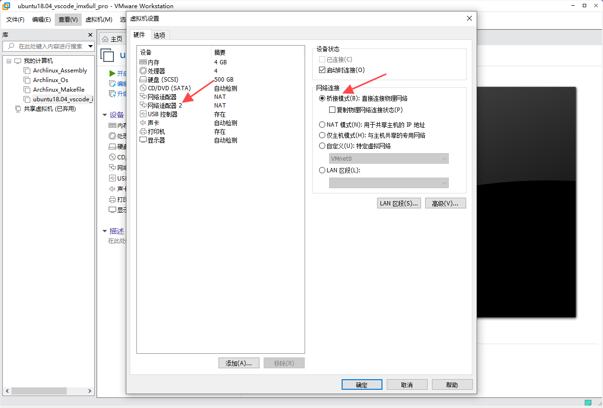
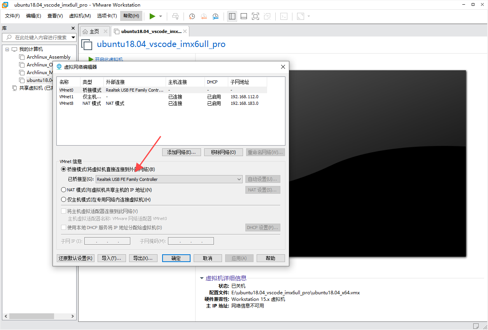
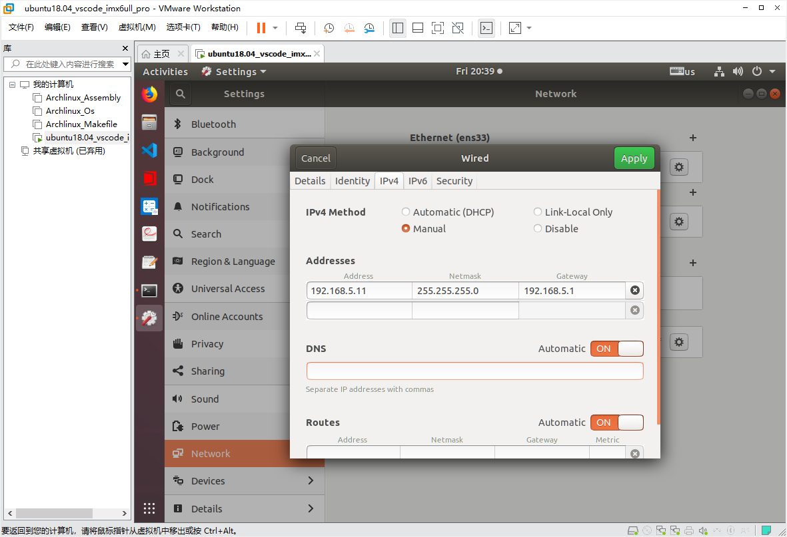
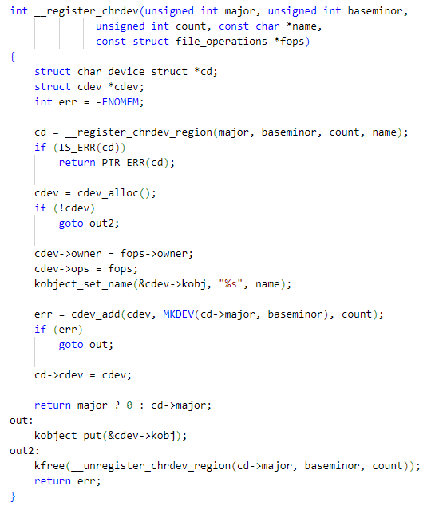

# Linux

## GCC

### GCC编译过程

1. 预处理（Preprocessing）
- 作用：处理源代码中的预处理指令（如 #include、#define、#ifdef 等），生成展开后的代码
 
- 操作：
    - 展开头文件（.h）：将 #include 替换为文件内容
    - 宏展开：将#define 定义的宏展开为实际内容
    - 条件编译：根据 #ifdef、#ifndef 保留或删除代码块
    - 删除注释

- 输出文件：.i 文件

- 命令：
```bash
gcc -E hello.c -o hello.i
```

2. 编译（Compilation）
- 作用：将预处理后的代码转换为汇编代码

- 操作：
    - 语法和语义分析
    - 生成中间代码并进行优化（如使用 -O2 优化选项）
    - 生成目标架构的汇编代码（如 x86 或 ARM）

- 输出文件：.s 文件

- 命令：
```bash
    gcc -S hello.i -o hello.s
    #或者直接从源文件编译
    gcc -S hello.c -o hello.s
```

3. 汇编（Assembly）
- 作用：将汇编代码转换为机器码（二进制目标文件）

- 操作：
    - 生成可重定位的机器指令
    - 生成符号表（记录函数和变量地址）
    - 输出文件：.o/.obj 文件

- 命令：
```bash
    gcc -c hello.s -o hello.o
    # 或直接从源文件生成目标文件
    gcc -c hello.c -o hello.o
```

4. 链接（Linking）
- 作用：合并多个目标文件和库文件，生成可执行文件

- 操作：
    - 静态链接：将静态库（.a 文件）代码复制到可执行文件中
    - 动态链接：记录动态库（.so 文件）的引用，运行时加载
    - 符号解析：解决函数和变量的地址引用

- 输出文件：可执行文件
- 命令：
```bash
gcc hello.o -o hello
# 直接编译并链接多个文件
gcc main.c utils.c -o app
```

### GCC常用选项
1. 基础编译选项

|选项|说明|
|:---|:---|
|-o <文件名>|指定输出文件名（默认 a.out）|
|-c|只编译不链接，生成 .o 目标文件|
|-E|仅预处理，输出到标准输出或指定文件（.i）|
|-S|生成汇编代码（.s 文件）|
|-v|显示编译详细过程（查看实际调用的子命令）|

- 命令
```bash
    gcc -c main.c -o main.o    # 生成目标文件
    gcc main.o -o app          # 链接生成可执行文件
```

2. 优化选项

|选项|说明|
|:---|:---|
|-O0|关闭优化（默认，适合调试）|
|-O1/-O|基础优化（平衡速度和体积）|
|-O2|深度优化（推荐发布版本使用）|
|-O3|激进优化（可能增加代码体积）|
|-Os|优化代码体积|
|-march=native|针对当前机器的 CPU 架构优化（如 x86-64）|

命令：
```bash
    gcc -O2 main.c -o app    # 使用 O2 优化级别编译
```

3. 调试选项

|选项|说明|
|:---|:---|
|-g|生成调试信息（GDB 使用）|
|-ggdb|生成更详细的 GDB 专用调试信息|
|-DDEBUG|定义宏 DEBUG（等价代码中的 #define DEBUG）|
|-UNDEBUG|取消宏定义|

命令：
```bash
    gcc -g -DDEBUG main.c -o app    # 支持调试并启用 DEBUG 宏
```

4. 头文件和库路径

|选项|说明|
|:---|:---|
|-I <路径>|指定头文件搜索路径（如 -I/usr/local/include）|
|-L <路径>|指定库文件搜索路径（如 -L/usr/local/lib）|
|-l <库名>|链接指定库（如 -lm 链接数学库 libm.so）|

命令：
```bash
    gcc main.c -I./include -L./lib -lmylib -o app
```

5. 警告选项

|选项|说明|
|:---|:---|
|-Wall|启用所有常见警告（推荐必加）|
|-Wextra|启用额外警告（比 -Wall 更严格）|
|-Werror|将警告视为错误（强制修复警告）|
|-w|关闭所有警告|
|-Wno-<警告名>|禁用特定警告（如 -Wno-unused-variable）|

命令：
```bash
    gcc -Wall -Wextra -Werror main.c -o app    # 严格模式
```

6. 链接选项

|选项|说明|
|:---|:---|
|-static|强制静态链接（所有库静态编译）|
|-shared|生成动态库（.so 或 .dll）|
|-fPIC|生成位置无关代码（动态库必需）|
|-pthread|链接多线程库并启用线程支持|

命令：
```bash
    gcc -shared -fPIC lib.c -o libmylib.so    # 生成动态库
    gcc main.c -static -o app_static          # 静态链接
```

7. 语言标准选项

|选项|说明|
|:---|:---|
|-std=<标准>|指定 C/C++ 标准（如 -std=c11、-std=c++17）|
|-ansi|等同于 -std=c89|

命令：
```bash
    gcc -std=c11 main.c -o app    # 使用 C11 标准编译
```

8. 其他常用选项

|选项|说明|
|:---|:---|
|-MMD|生成依赖关系文件（.d），用于 Makefile 自动化|
|-save-temps|保留所有中间文件（.i, .s, .o）|
|-pipe|使用管道替代临时文件（加快编译速度）|
|-nostdlib|不链接标准库（手动指定入口函数时使用）|

命令：
```bash
    gcc -save-temps main.c -o app    # 保留预处理、汇编等中间文件
```

## 环境搭建

### 双网卡的配置
NAT网卡（虚拟网卡，Windows能访问外网, ubuntu就可以访问外网）保证ubuntu可以上网


桥接网卡（真实的网卡，通过usb网卡与开发板相连）保证ubuntu可以跟开发板互通
桥接网卡的配置
1. 增加网络适配器2，并设置为桥接模式


2. 打开虚拟网络编辑器，指定网络适配器2的网卡为USB网卡


3. 手动设置ubuntu的ip地址为192.168.5.11


3. 手动设置windows的ip地址为192.168.5.10

4. 用串口连接开发板，并设置开发板的ip
    ifconfig eth0 192.168.5.9

5. 开发板，ubuntu，windows三者互ping

## 编译运行第一个驱动程序

### 编译内核(//TODO)
- 不同的开发板对应不同的配置文件，配置文件位于内核源码的arch/arm/configs/目录
- 在arch/arm/boot目录下生成zImage
- 输入以下命令编译内核
    make mrproper
    make 100ask_imx6ull_defconfig
    make zImage -j4
- 拷贝zImage到nfs_rootfs备用

### 配置内核(//TODO)

### 编译设备树
- 在arch/arm/boot/dts 目录下生成设备树的二进制文件 100ask_imx6ull-14x14.dtb
- 输入以下命令编译设备树
    make dtbs
- 拷贝100ask_imx6ull-14x14.dtb到nfs_rootfs备用

### 将设备树，zImage，modules复制到开发板
- cp /mnt/zImage /boot
- cp /mnt/100ask_imx6ull-14x14.dtb /boot
- cp /mnt/lib/modules /lib -rfd

sync 将内容强制刷到FLASH
reboot 重启

## Makefile

### 为什么需要Makefile

### Makefile的规则

### Makefile的语法

### Makefile的函数

### 通用Makefile

## Linux应用开发基础知识

## Linux驱动开发基础知识

### 模块化编程
Linux内核采用的是以模块化形式管理内核代码

#### 模块相关命令
- 编译（make）
- 显示模块（lsmod）
- 安装/卸载模块（insmod/rmmod）
- 打印log信息（dmesg）

### 符号导出
什么是符号？
- 符号指的是全局变量和函数

内核中的每个模块是下相互独立的，那么A模块的全局变量和函数，B模块是无法直接访问的

#### 符号表
如果B模块想访问A模块的全局变量和函数，就需要用EXPORT_SYMBOL将它们导出到符号表
符号导出后的位置
- 在ubuntu中全局符号表在/usr/src/linux-headers-xxx-generic-pae/Module.symvers
- 在自己编译的内核中全局符号表在根目录下的Module.symvers
  
#### 验证
编译好模块A之后将生成的符号表Module.symvers存放到模块B的目录下，编译模块B

详见02_export

注意：
- 先加载模块A，再加载模块B
- 先卸载模块B，再卸载模块A

### 模块传参

#### 原型
module_param(name, type, perm)
- name用来接收参数的变量名
- type参数的数据类型
- perm指定参数访问权限
- 数据类型有
  - bool
  - invbool
  - charp
  - int
  - long
  - short
  - uint
  - ulong
  - ushort

module_param_string(name, string, len, perm)
module_param_array(name, type, num_point, perm)
MODULE_PARM_DESC(dbg, "boolean to enable debugging(0/1 == off/on)")


#### sysfs
即系统文件系统，内核给一些重要的资源创建的目录或文件，加载模块的时候会在/sys/module下创建一个同名的文件

可以在/sys/module/模块名/parameters看到变量名
可以在/sys/module/模块名/parameters/变量名/看到变量内容

#### 验证
sudo insmod param.ko string=tdhh
sudo rmmod param.ko

详见03_param

### 系统调用
头文件：unistd.h

读
```c
ssize_t read(int fd, void *buf, size_t count);
功能：从文件描述符fd中读取count 字节的数据到buf缓冲区
参数：
- fd：文件描述符（如通过 open 打开的返回值）
- buf：指向缓冲区的指针，用于存储读取的数据
- count：期望读取的字节数
返回值：
成功：返回实际读取的字节数
文件末尾：返回 0
失败：返回 -1，并设置 errno 错误码134
```

写
```c
ssize_t write(int fd, const void *buf, size_t count);
功能：将 buf 缓冲区中的 count 字节数据写入文件描述符 fd
参数：
fd：文件描述符
buf：指向待写入数据的缓冲区指针。
count：期望写入的字节数
返回值：
成功：返回实际写入的字节数
失败：返回 -1，并设置 errno134

```

### 设备分类
- 字符设备
- 块设备
- 网络设备

### 字符设备

#### 字符设备架构（//TODO）

#### 设备号
- 32位无符号整型，前12位是主设备号，后20位是次设备号

#### 构造设备号的宏
MKDEV(major, minor)
- major主设备号
- minor次设备号

#### 创建/注销设备号
int register_chrdev_region(dev_t from, unsigned count, const char* name)
int unregister_chrdev_region(dev_t from, unsigned count)
- from是起始设备号
- count需要分配的连续设备号数量
- 设备名称
- 成功返回0，失败返回负值

#### cdev
- void cdev_init(struct cdev*, const struct file_operations*)
- int cdev_add(struct cdev*, dev_t unsigned)
- void cdev_del(struct cdev*)

#### 手动创建设备节点
mknod /dev/设备名 c 主设备号 次设备号
- c代表字符设备
- b就是块设备

#### 更简单的创建字符设备的方法
```c
static inline int  register_chrdev(unsigned int major, const char* name, const struct file_operations* fops)
static inline void unregister_chrdev(unsigned int major, const char* name)
```

实际register_chrdev调用了__register_chrdev实现了register_chrdev_region，cdev_alloc以及cdev_add的封装


#### 自动创建设备节点
返回值判断（//TODO）
```c
static inline bool __must_check IS_ERR(const void *ptr) {
    return IS_ERR_VALUE((unsigned long)ptr);
}
#define IS_ERR_VALUE(x) unlikely((unsigned long)(void *)(x) >= (unsigned long)-MAX_ERRNO)

```

设备节点的类
```c
#define class_create(owner, name)		\
({						\
	static struct lock_class_key __key;	\
	__class_create(owner, name, &__key);	\
})

struct class *__class_create(struct module *owner, const char *name,
			     struct lock_class_key *key)
void class_destroy(struct class* cls)
```

设备节点
```c
struct device *device_create(struct class *class, struct device *parent,
			     dev_t devt, void *drvdata, const char *fmt, ...)
void device_destroy(struct class *class, dev_t devt)
```

#### 查看设备相关信息
1. 查看 /sys/class 下的类信息
class_create 会在 /sys/class 目录下生成对应的类目录
```bash
# 查看类是否存在
ls -l /sys/class
# 查看特定类下属性的属性
ls -l /sys/class/特定类
如果类创建成功，会在此目录下看到设备相关的属性和子目录
```

2. 查看 /dev 下的设备节点
device_create 会在 /dev 目录下生成设备节点文件
```bash
# 查看字符设备节点是否存在
ls -l /dev/设备节点
```

3. 查看 /proc/devices 中的注册设备
register_chrdev 会将字符设备注册到内核
```bash
# 查看字符设备的注册信息
cat /proc/devices
```

4. 查看 /sys/devices 中的设备详细信息
device_create 生成的设备信息会记录在 /sys/devices/virtual/类的名称/字符设备的名称
```bash
# 查看设备节点的信息
ls -l /sys/devices/virtual/类的名称/字符设备的名称
dev是主设备号和次设备号，uevent是主设备，次设备号和字符设备名称
```

#### 用户到内核的安全拷贝
```c
inline long copy_to_user(void __user *to, const void *from, long n)
inline long copy_from_user(void *to, const void __user *from, long n)
-返回值：未成功拷贝的字节数，0代表完全成功
```
