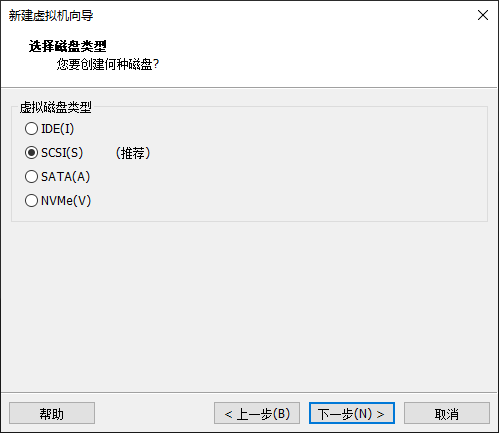
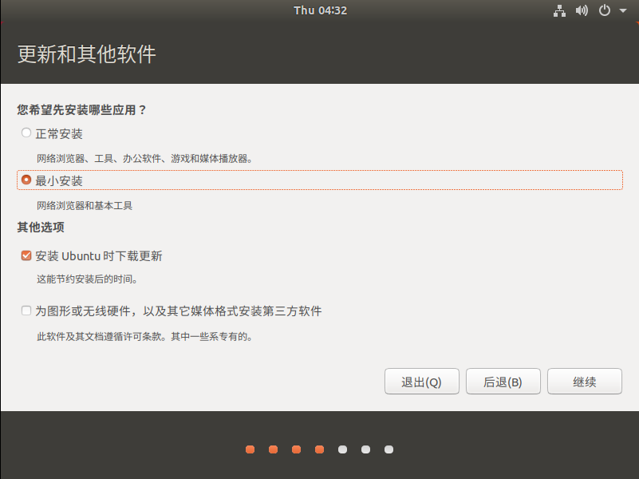

## 环境搭建

### ubuntu
下载地址：https://mirrors.aliyun.com/ubuntu-releases/

版本：ubuntu-18.04.6-desktop-amd64

一路下一步到finish

一路继续，直到安装完成

### ssh
获取最新的软件源信息：apt update

安装ssh：apt install openssh-server

启动ssh服务：systemctl start ssh

开机自启ssh：systemctl enable ssh

检查ssh服务状态：systemctl status ssh

### 配置网络
安装网络工具：sudo apt install net-tools

## 创建Source_Insight工程

点击Project ---> New Project

Project ---> Synchronize Files

